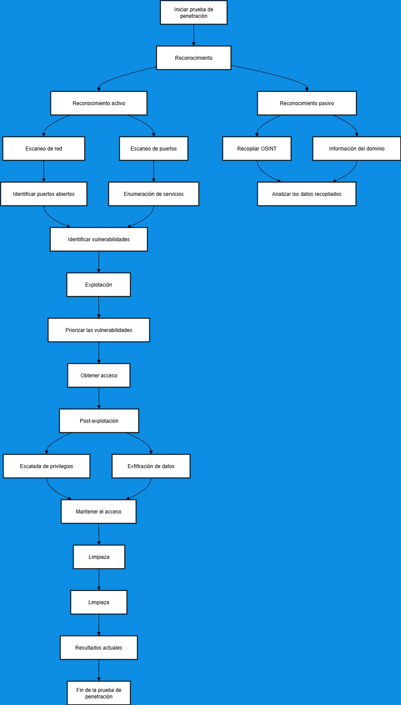

# 🛠️ Hub de Recursos Técnicos y Ciberseguridad

Una base de conocimientos centralizada diseñada para administradores de sistemas, ingenieros de red y entusiastas de la ciberseguridad. Este repositorio compila guías prácticas, comandos esenciales y metodologías para la gestión y auditoría de infraestructuras tecnológicas.

---

### 📂 Contenido Principal

*   **🐧 Administración de Sistemas**: Guías exhaustivas para el dominio del entorno Linux, desde la gestión de archivos hasta la automatización de tareas.
*   **🌐 Redes y Protocolos**: Catálogo detallado de servicios, puertos y técnicas de análisis de tráfico.
*   **🛡️ Auditoría de Seguridad**: Metodologías paso a paso para la identificación de vulnerabilidades y endurecimiento de sistemas.
*   **⚡ Transferencia Eficiente**: Recursos para la gestión de datos remotos y protocolos de comunicación.

---

### 🗺️ Metodología de Trabajo

A continuación se presenta el flujo estándar seguido en procesos de auditoría y pentesting:

---

### 🚀 Guías de Referencia Rápida

| Recurso | Descripción | Enlace |
| :--- | :--- | :--- |
| **Linux Cheat Sheet** | Comandos de navegación, permisos, procesos y servicios. | [Ver Guía ➔](docs/linux-cheatsheet.md) |
| **Network Ports** | Análisis de puertos TCP/UDP y servicios asociados. | [Ver Guía ➔](docs/ports.md) |
| **FTP Manual** | Operaciones avanzadas de transferencia de archivos. | [Ver Guía ➔](docs/ftp-cheatsheet.md) |

---

---

**Hecho por Cyberdark by Whoami-labs.com**
