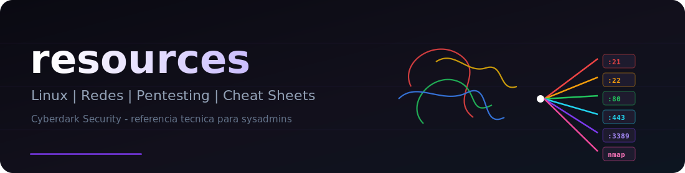
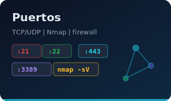
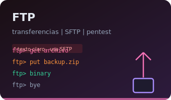

# Recursos Técnicos

<picture>
  
</picture>

Bienvenido al hub de documentación. Selecciona una guía o usa la búsqueda (icono superior en la vista MkDocs).

---

## Guías

<table>
  <tr>
    <td align="center" width="33%">
      <a href="linux-cheatsheet.md"></a>
    </td>
    <td align="center" width="33%">
      <a href="ports.md"></a>
    </td>
    <td align="center" width="33%">
      <a href="ftp-cheatsheet.md"></a>
    </td>
  </tr>
</table>

---

## Referencia rápida

| Puerto | Servicio | Notas |
| :---: | :--- | :--- |
| **22** | SSH | Acceso remoto cifrado — preferir siempre sobre Telnet |
| **80** | HTTP | Sin cifrado — usar HTTPS en producción |
| **443** | HTTPS | Tráfico web cifrado |
| **21** | FTP | Texto claro — usar SFTP/SCP |
| **53** | DNS | Resolución de nombres |
| **3389** | RDP | Escritorio remoto Windows |

| Comando | Uso frecuente |
| :--- | :--- |
| `ls -lah` | Listar archivos con detalle y tamaños legibles |
| `cd ~` | Ir al directorio home |
| `grep -r "patrón" .` | Buscar en archivos recursivamente |
| `systemctl status servicio` | Estado de un servicio systemd |
| `nmap -sV -p- objetivo` | Escaneo de puertos con detección de versión |

---

## Mapa del repositorio

```text
resources/
├── README.md                 ← Punto de entrada (GitHub)
├── plan-maestro.md           ← Roadmap Whoami-Labs
├── docs/
│   ├── assets/               ← Banners y cards visuales
│   ├── index.md              ← Esta página (MkDocs home)
│   ├── linux-cheatsheet.md
│   ├── ports.md
│   └── ftp-cheatsheet.md
└── mkdocs.yml                ← Configuración del sitio
```

---

> [!TIP]
> En pentesting, cruza la guía de **puertos** con la sección de **herramientas** en Linux para un flujo de reconocimiento → enumeración → explotación.
